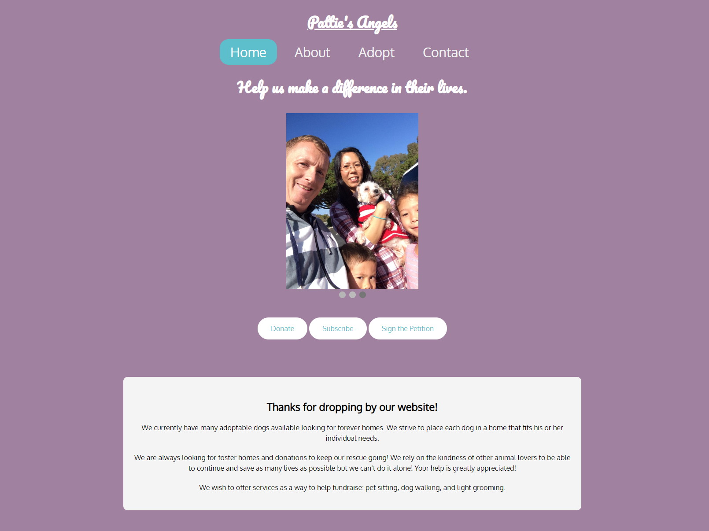
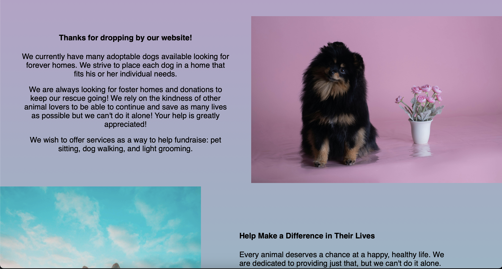
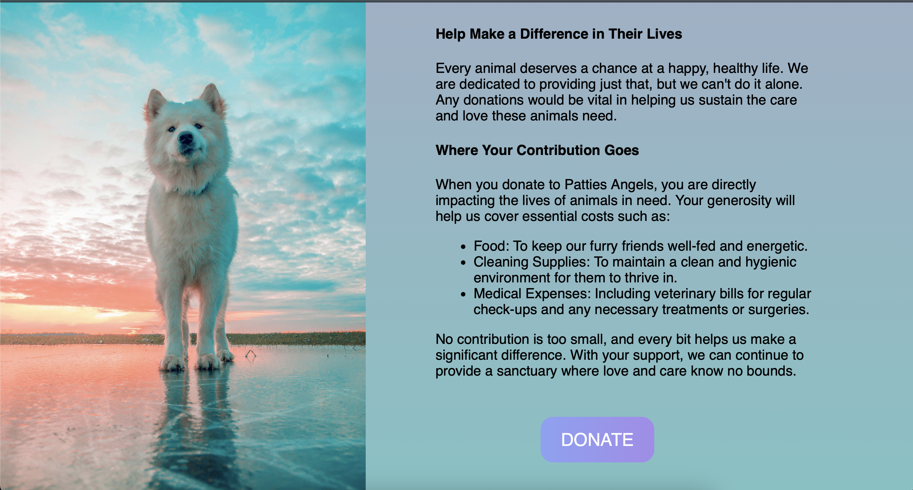

<a name="readme-top"></a>

<!-- PROJECT LOGO -->
<br />
<div align="center">


<h3 align="center">PAWS</h3>

  <p align="center">
    Pattie's Angels Webapp
    <br />
    <a href="https://patties-angels-8cd06741a91a.herokuapp.com/">View Site</a>
  </p>
</div>


<!-- TABLE OF CONTENTS -->
<details>
  <summary>Table of Contents</summary>
  <ol>
    <li>
      <a href="#about-the-project">About The Project</a>
      <ul>
        <li><a href="#built-with">Built With</a></li>
      </ul>
    </li>
    <li><a href="#roadmap">Roadmap</a></li>
    <li>
      <a href="#getting-started">Getting Started</a>
      <ul>
        <li><a href="#prerequisites">Prerequisites</a></li>
        <li><a href="#access-project-without-local-install">Access project without local install</a></li>
      </ul>
    </li>
    <li><a href="#usage">Usage</a></li>
    <li><a href="#testing">Testing</a></li>
    <ul>
        <li><a href="#importing-your-own-unit-Tests">Importing your own Unit Tests</a></li>
        <li><a href="#writing-your-unit-tests">Writing your Unit Tests</a></li>
      </ul>
    <li><a href="#deployment">Deployment</a></li>
    <li><a href="#developer-instructions">Developer Instructions</a></li>
    <li><a href="#contact">Contact</a></li>
    <li><a href="#acknowledgments">Acknowledgments</a></li>
  </ol>
</details>


<!-- ABOUT THE PROJECT -->
## About The Project

Pattie's Angels  is a local Animal rescue that has a goal to eliminate euthanasia by providing education, training, microchipping, spaying and neutering the animals.

The problem that we have is that the client doesn't have a well-developed website that can provide the needs in the 21st century.​

The plan is to develop a high-end website with a backend and providing an easier way of adopting animals. We eager to create a form where each client will put in their information and it will be sent to backlog for the client to review. The client will be provided with a backend that has a login page for only them to access and be able to make changes on the website. ​

<p align="right">(<a href="#readme-top">back to top</a>)</p>


### Built With

<!--
 [![Heroku][Heroku.com]][Heroku-url]
 [![NodeJS][NodeJS]][NodeJS-url]

 [![VSCode][VSCode]][VSCode-url]
 [![Mocha][Mocha]][Mocha-url]
 [![Chai][Chai]][Chai-url]
-->
[][Heroku-url]
[][NodeJS-url]

[][VSCode-url]
[][Mocha-url]
[][Chai-url]

<p align="right">(<a href="#readme-top">back to top</a>)</p>

<!-- ROADMAP -->
## Roadmap
* Sprint 3 (October 24th to November 12th): First prototype of front end pages, including home page, about page, adopt page and contact page with a linking navigation bar. 

<!--




-->


* Sprint 4 (November 13th to 26th November): Mock API call, relational database backend prototype, login page, testimonials page, admin pages and admin logins. Website deployed to Heroku and accessible to all.

* Sprint 5 (January 26th to February 11th): Created the add pet feature, view pets feature, edit pets feature and setup all database structures in Heroku backend.

* Sprint 6 (February 12th to February 25th): TBD - Khadeeja

* Sprint 7 (February 26th to March 10th): Retrieving active pets, adding a new pet button, sending new pets to the database, enhancing the Adopt page, and creating a simple web adoption form.

* Sprint 8 (March 20th to March 31st): Created the Login function for the admins to access the back-end and be able to make changes. 

* Sprint 9 (April 1st to Aptil 14th): Implemented an Amazon S3 bucket for uploading and editing images for animal listings on the admin dashboard. Along with updating the website UI and making the application form accessible on each animal listing.

* Sprint 10 (April 15th to Aptil 28th): TBD - Fernando

<p align="right">(<a href="#readme-top">back to top</a>)</p>

<!-- GETTING STARTED -->
## Getting Started

To run this project locally:

### Prerequisites
* Updated browser connected to Internet<br>
* Updated VSStudio installed with cloned repo from this URL:

  ```sh
  Enter this URL: https://github.com/samialhamad/pattiesangels
  ```
  <br>
* Live Preview extension, or click "Run" on any HTML page


### Access Project without local install

1. On any updated modern browser
2. Enter this URL into the URL bar:
   ```sh
   https://patties-angels-8cd06741a91a.herokuapp.com/
   ```
3. Enter and you will see our most recently deployed branch.

<p align="right">(<a href="#readme-top">back to top</a>)</p>


<!-- USAGE EXAMPLES -->
## Usage

View any of the available pages by navigating using the navigation bar at the top. The home page
has links to items such as donations, subscriptions and petitions. 

The adopt page will have an updated list of animals available to be resuced, and an apply button that redirects clients to a form where they will fill out their contact information and schedule a visit.

The admin/owner of the site will have an admin login accessible via the Login tab, from where they can edit their database of available animals and review application forms.

<p align="right">(<a href="#readme-top">back to top</a>)</p>

<!-- TESTING -->
## Testing

Unit testing was completed utilizing the <a href="https://mochajs.org/">Mocha</a> framework alongside the <a href="https://www.chaijs.com/">Chai library</a>. Unit tests were written for functions and models throughout the project, using various functions such as the expect, assert, describe, and actual functions. A live view of the result of each unit test can be found <a href="https://patties-angels-8cd06741a91a.herokuapp.com/tests/tests.html">here</a>, on the domain, or locally by navigating to the <a href="https://github.com/samialhamad/pattiesangels/blob/main/frontend/tests/tests.html ">tests.html</a> file and opening it locally.

### Importing your own Unit Tests 

To add a source for a unit test, navigate to the frontend/tests/tests.html file. Navigate to the <a href="https://github.com/samialhamad/pattiesangels/blob/main/frontend/tests/tests.html ">tests.html</a> file and navigate to the commented "Source" section, where you can import your source for the unit test. In this case, the animal model was being tested, so the import is as follows: 

```sh
   <script src="../model/animal/animal.js"></script>
   ```
 
You will also import your script source files, under the commented "Test" section of tests.html 


### Writing your Unit Tests 

Your unit test should be written in the same folder as the model you are testing, concatenated with the word “tests” 

 

For example, the animal unit tests are written in the animal model folder, and is titled <a href="ttps://github.com/samialhamad/pattiesangels/blob/main/frontend/model/animal/animaltests.js "> animaltests.html</a>

The unit tests should be written similar to any JavaScript function, with camel case nomenclature. The unit tests written for the Animal ageString computed variable (example snippet below) provide the format for writing a unit test with the Mocha/Chai frameworks. The actual variable is the variable you want to test and confirm, while the expected value is what you are comparing to. If you want to intentionally create an invalid unit test, make the expect value an invalid input. Finally, use the assert function using the actual, function and arguments.callee.name parameters.

```s
testAgeString0Months();
function testAgeString0Months() {
    var animal = new Animal();
    animal.ageInMonths = 0;

    var actual = animal.ageString;
    var expected = "0 months old"
    assert(actual, expected, arguments.callee.name);
}
```

After writing your unit test, when you go to the tests.html linked above, it will show either a green checkmark indicating a successful unit test, or a red unit test indicating a failed unit test. In the event of a failed unit test, error codes will be thrown explaining why the test failed.

<p align="right">(<a href="#readme-top">back to top</a>)</p>

<!-- DEPLOYMENT -->

## Deployment

To be implemented in 191 - Steven

<p align="right">(<a href="#readme-top">back to top</a>)</p>

<!-- DEVELOPER INSTRUCTIONS -->

## Developer Instructions

To be implemented in 191 

<p align="right">(<a href="#readme-top">back to top</a>)</p>

<!-- CONTACT -->
## Contact


Project Link: [https://github.com/samialhamad/pattiesangels](https://github.com/samialhamad/pattiesangels)

<p align="right">(<a href="#readme-top">back to top</a>)</p>


<!-- ACKNOWLEDGMENTS -->
## Acknowledgments

* [Sami Alhamad](https://github.com/samialhamad)
* [Khadeeja Baqui](https://github.com/khadeejabaqui1)
* [Phuc Dinh](https://github.com/dinhphucv)
* [Fernando Moreno Mendez](https://github.com/FernandoM0)
* [Jasmine Pincombe](https://github.com/jazzypp)
* [Demyan Soshnov](https://github.com/dsoshnov)
* [Raymond Waters](https://github.com/RaymondH2OS)
* [Steven Yu](https://github.com/Syekan)

<p align="right">(<a href="#readme-top">back to top</a>)</p>


<!-- MARKDOWN LINKS & IMAGES -->
<!-- https://www.markdownguide.org/basic-syntax/#reference-style-links -->
[contributors-shield]: https://img.shields.io/github/contributors/github_username/repo_name.svg?style=for-the-badge
[contributors-url]: https://github.com/github_username/repo_name/graphs/contributors
[forks-shield]: https://img.shields.io/github/forks/github_username/repo_name.svg?style=for-the-badge
[forks-url]: https://github.com/github_username/repo_name/network/members
[stars-shield]: https://img.shields.io/github/stars/github_username/repo_name.svg?style=for-the-badge
[stars-url]: https://github.com/github_username/repo_name/stargazers
[issues-shield]: https://img.shields.io/github/issues/github_username/repo_name.svg?style=for-the-badge
[issues-url]: https://github.com/github_username/repo_name/issues
[license-shield]: https://img.shields.io/github/license/github_username/repo_name.svg?style=for-the-badge
[license-url]: https://github.com/github_username/repo_name/blob/master/LICENSE.txt
[linkedin-shield]: https://img.shields.io/badge/-LinkedIn-black.svg?style=for-the-badge&logo=linkedin&colorB=555
[linkedin-url]: https://linkedin.com/in/linkedin_username
[product-screenshot]: images/screenshot.png
[Next.js]: https://img.shields.io/badge/next.js-000000?style=for-the-badge&logo=nextdotjs&logoColor=white
[Next-url]: https://nextjs.org/
[React.js]: https://img.shields.io/badge/React-20232A?style=for-the-badge&logo=react&logoColor=61DAFB
[React-url]: https://reactjs.org/
[Vue.js]: https://img.shields.io/badge/Vue.js-35495E?style=for-the-badge&logo=vuedotjs&logoColor=4FC08D
[Vue-url]: https://vuejs.org/
[Angular.io]: https://img.shields.io/badge/Angular-DD0031?style=for-the-badge&logo=angular&logoColor=white
[Angular-url]: https://angular.io/
[Svelte.dev]: https://img.shields.io/badge/Svelte-4A4A55?style=for-the-badge&logo=svelte&logoColor=FF3E00
[Svelte-url]: https://svelte.dev/
[Laravel.com]: https://img.shields.io/badge/Laravel-FF2D20?style=for-the-badge&logo=laravel&logoColor=white
[Laravel-url]: https://laravel.com
[Bootstrap.com]: https://img.shields.io/badge/Bootstrap-563D7C?style=for-the-badge&logo=bootstrap&logoColor=white
[Bootstrap-url]: https://getbootstrap.com
[JQuery.com]: https://img.shields.io/badge/jQuery-0769AD?style=for-the-badge&logo=jquery&logoColor=white
[JQuery-url]: https://jquery.com 
[Heroku-url]: https://www.heroku.com/
[Heroku.com]: https://upload.wikimedia.org/wikipedia/commons/e/ec/Heroku_logo.svg

[NodeJS-url]: https://nodejs.org/en/
[NodeJS]: https://upload.wikimedia.org/wikipedia/commons/d/d9/Node.js_logo.svg

[VSCode-url]: https://code.visualstudio.com/
[VSCode]: https://cdn.worldvectorlogo.com/logos/visual-studio-code-1.svg

[Mocha-url]: https://mochajs.org/
[Mocha]: https://upload.wikimedia.org/wikipedia/commons/d/de/Mocha_logo.svg

[Chai-url]: https://www.chaijs.com/
[Chai]: https://cdn.icon-icons.com/icons2/2699/PNG/512/chaijs_logo_icon_167759.png
